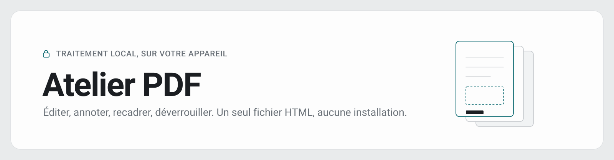

  

# Atelier PDF

Outil de manipulation de PDF en un seul fichier HTML. Aucune installation, aucun compte, aucun serveur : tout le traitement se fait dans le navigateur, aucun fichier ni mot de passe ne transite par le réseau.

Application : https://ninjathune-human.github.io/atelier-pdf/

## Fonctions

| Fonction | Détail |
|---|---|
| Organiser | Sélection, réorganisation par glisser-déposer, suppression au clavier ou au bouton, toujours annulable |
| Ajouter | Pages d'autres PDF ou images (JPEG, PNG, HEIC, WebP), prévisualisées avant insertion : on coche les pages voulues |
| Extraire | Sort la sélection courante dans un fichier séparé, sans altérer le document de travail |
| Déverrouiller | Retire un mot de passe connu ou des restrictions de permissions (qpdf-wasm). S'ouvre d'elle-même sur un PDF protégé |
| Rechercher | Plein texte dans la couche de texte du PDF et dans les mots reconnus par OCR, surlignage en grille et en annotation |
| Convertir | **Bêta.** Document Word (.docx) converti en pages PDF vectorielles, texte sélectionnable, puis choix des pages à insérer |
| Recadrer | Rectangle ajustable, détection automatique du contenu, page par page ou par lot |
| Pivoter | ±90°, par page ou par lot, depuis la barre de sélection |
| Supprimer les marges | Détection du contenu, marge conservée réglable, annulation à bascule |
| Annoter | Stylo, surligneur, rectangle, ellipse, flèche, texte, image, correction par masquage. Vectoriel à l'export. Zoom, pincement et déplacement de la vue. Double-clic sur une vignette pour y entrer |
| Rédiger | Suppression réellement destructive : la zone est peinte au niveau du pixel avant réencodage |
| OCR | Français, anglais ou les deux. Couche de texte invisible calée sur les mots détectés |
| Compresser | Trois préréglages, rastérisation et réencodage JPEG |
| Exporter | Vectoriel préservé, sauf sur les pages contenant une rédaction |
| Apparence | Mode clair par défaut, bascule vers le mode nuit, choix mémorisé. Respecte les réglages système de transparence réduite, de contraste renforcé et de mouvement réduit |

Le modèle est non destructif : recadrage, rotation, annotations, rédaction et OCR sont conservés en état et appliqués uniquement à l'export.

L'orientation du document d'origine est respectée partout, vignettes comme éditeur d'annotation. Un texte saisi sur une page pivotée s'écrit droit à l'écran et reste solidaire du papier si la page est pivotée ensuite.

## Usage

Ouvrir `atelier-pdf.html` dans un navigateur, ou passer par le lien ci-dessus. Conçu pour PC, iPad et iPhone, avec prise en charge du tactile et du stylet.

La barre d'outils regroupe quatre menus, Modifier, Ajuster, Annoter et Convertir, un champ de recherche, puis Compresser et Exporter. Les rotations et la suppression vivent dans la barre de sélection, au-dessus des vignettes, puisqu'elles portent sur les pages choisies.

| Raccourci | Effet |
|---|---|
| Double-clic sur une vignette | Ouvre l'éditeur d'annotation sur cette page |
| Suppr, ou Retour arrière | Supprime les pages sélectionnées, annulable |
| Échap | Ferme la fenêtre ouverte, ou vide le champ de recherche |
| Espace maintenu, ou bouton central | Déplace la vue dans l'éditeur d'annotation |
| Ctrl ou Cmd + molette, pincement | Zoome dans l'éditeur d'annotation |
| Maj + molette | Défilement latéral dans l'éditeur d'annotation |

## Dépendances

Chargées par CDN à l'exécution, pas de build :

- [pdf-lib](https://pdf-lib.js.org/) 1.17.1, mutation des pages et dessin vectoriel
- [pdf.js](https://mozilla.github.io/pdf.js/) 3.11.174, rendu des pages en canvas
- [qpdf-wasm](https://github.com/neslinesli93/qpdf-wasm), déverrouillage, chargé à la demande
- [tesseract.js](https://tesseract.projectnaptha.com/) 5, OCR, chargé au premier usage
- [docx-preview](https://github.com/VolodymyrBaydalka/docxjs) 0.4.1 et [JSZip](https://stuk.github.io/jszip/) 3.10.1, lecture et composition des fichiers Word, chargés au premier usage
- [@pdf-lib/fontkit](https://github.com/Hopding/fontkit) 1.1.1, intégration des polices dans le PDF converti
- Polices [Arimo, Tinos et Carlito](https://fontsource.org/), licence OFL, jumelles métriques d'Arial, Times New Roman et Calibri

Une connexion est donc nécessaire au premier chargement. Une version entièrement embarquée hors-ligne est une piste ouverte.

## Limites connues

- Le déverrouillage suppose un mot de passe connu. Aucune tentative par force brute n'est possible ni prévue.
- La compression transforme le texte natif en image : il n'est plus sélectionnable dans le fichier compressé.
- Les images ne peuvent pas encore ouvrir une session vide, un PDF de départ est requis.
- La modale de recadrage affiche la page non tournée, contrairement à la grille et à l'annotation.
- La conversion Word est en bêta. Fidèle sur les documents courants, courrier, compte rendu, CV. Approchée sur les zones de texte, formes, trames à motif et champs calculés. La pagination suit celle de Word lorsque le fichier en garde la trace, c'est-à-dire lorsqu'il a été enregistré en dernier par Word ; sinon elle est recalculée. Pour un rendu exact, exporter en PDF depuis Word ou Pages. `docx-labo.html` mesure la fidélité d'une conversion sur un fichier donné.
- La recherche positionne le surlignage au prorata des caractères : sur une police à chasse variable, il peut déborder d'un caractère. Les textes pivotés à l'intérieur du PDF, cartouches verticaux notamment, sont mal encadrés.
- Les vignettes sont toutes calculées à l'ouverture. Sur un document de plusieurs dizaines de pages, prévoir un temps de chargement.

## Licence

À définir.
